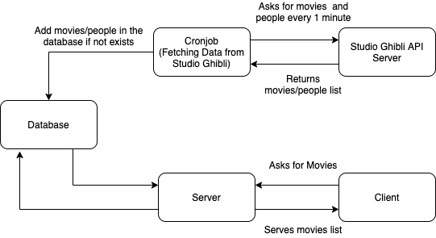

# movie-catalog

## Setup

#### Pre-requisites
You need to install `docker` and `docker-compose` according to your OS from following links
1. [Docker](https://docs.docker.com/engine/install/)
1. [Docker Compose](https://docs.docker.com/compose/install/)

#### Run Server
1. `docker-compose build --no-cache`
1. `docker-compose up`

#### Visit URL in Browser
`http://localhost:8000/movies/`

#### Run Tests
`docker exec -it movie_catalog bash -c "python manage.py test"`

## Architecture
